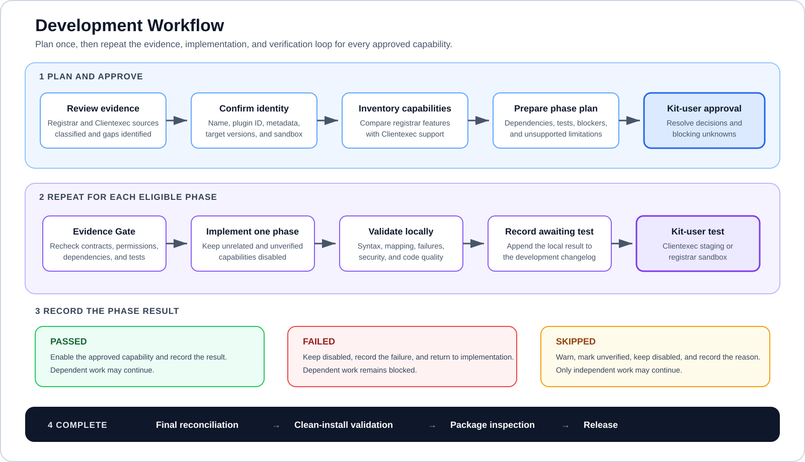
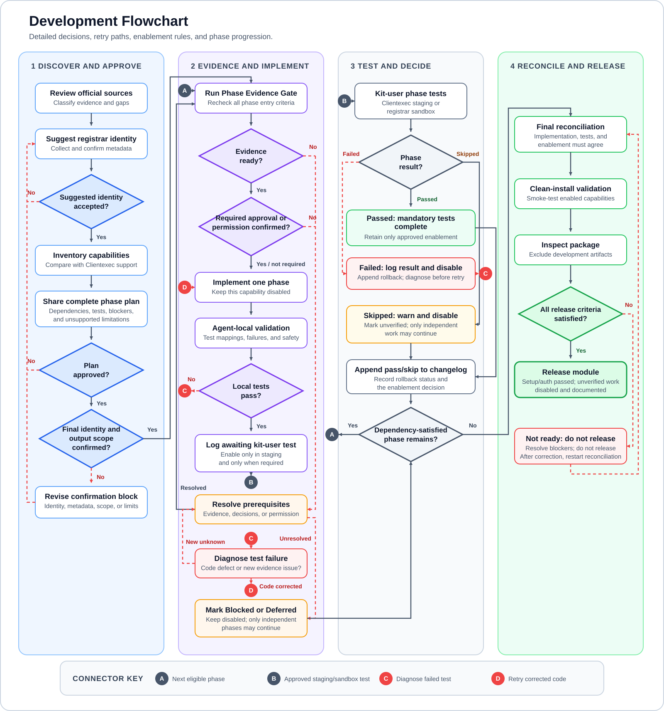

# Clientexec Registrar Development Kit

An evidence-based, phase-gated development kit for building and reviewing Clientexec domain registrar modules with AI coding agents.

The kit combines verified Clientexec contracts, registrar documentation, strict write boundaries, fail-closed implementation, phase-specific evidence gates, local validation, and kit-user staging or sandbox feedback.

> This is a temporary README candidate. It is not part of a registrar module and must not be included in a registrar release archive.

## What This Kit Does

The kit guides an AI coding agent to:

1. Review and classify registrar sources.
2. Derive and confirm a Clientexec-compatible module identity.
3. Inventory registrar capabilities and compare them with Clientexec support.
4. Share a complete phase-by-phase implementation plan and limitation summary.
5. Implement one evidence-ready phase at a time.
6. Validate locally and pause for kit-user staging or sandbox feedback.
7. Keep failed, skipped, blocked, unsupported, and unfinished capabilities disabled.
8. Maintain a sanitized development changelog.
9. Reconcile implemented, tested, and enabled capabilities before packaging.

Only capabilities supported by both the registrar and the target Clientexec version are implemented. Registrar functions without a verified Clientexec integration point are ignored and reported as unsupported Clientexec limitations.

## Quick Navigation

- [Safety Boundaries](#safety-boundaries)
- [Quick Start](#quick-start)
- [Choose a Development Scope](#choose-a-development-scope)
- [Starting Prompt](#starting-prompt-without-placeholders)
- [Identity and Metadata Confirmation](#registrar-identity-and-metadata-confirmation)
- [Development Workflow](#development-workflow)
- [Development Flowchart](#development-flowchart)
- [Implementation Phases](#implementation-phases)
- [Testing and Feedback](#testing-and-kit-user-feedback)
- [Supported AI Agents](#supported-ai-agents)
- [Directory Structure](#directory-structure)
- [Requirements](#requirements)
- [Validation](#validation)
- [Continuous Integration](#continuous-integration)
- [Release Packaging](#release-packaging)

## Safety Boundaries

Classify the task before writing:

- Audit, review, diagnosis, or report: keep the entire repository read-only.
- Source intake or workspace initialization: write source-manifest and sanitized input files only when explicitly requested.
- Registrar module implementation: write only inside `workspace/<registrar>/output/`.
- Skill maintenance: modify skill-owned files only in a separate, explicitly requested task.

During module implementation, treat `SKILL.md`, `references/`, `assets/`, `scripts/`, repository configuration, root documentation, supplied inputs, source manifests, templates, and every other registrar workspace as read-only.

Never request credentials in a prompt. If a likely real credential appears anywhere, stop using it, do not reproduce it, immediately warn the kit user to revoke or rotate it, and treat it as compromised even if the exposed copy is deleted.

Never perform a live, billable, irreversible, or difficult-to-recover registrar operation without explicit permission and a recovery plan.

## Quick Start

1. Clone or download the complete kit.
2. Open the kit root in a supported AI coding agent.
3. Review `SKILL.md` and any script before allowing execution.
4. Supply official registrar documentation, a public documentation URL, attached sanitized files, or an explicitly authorized source-intake request.
5. Use the starting prompt below.
6. Confirm the suggested module identity and metadata.
7. Review and approve the complete implementation plan.
8. Test each completed phase in Clientexec staging and the registrar sandbox.

```bash
git clone https://github.com/cornQ/clientexec-registrar-development-kit.git
cd clientexec-registrar-development-kit
```

Do not paste API keys, passwords, tokens, cookies, EPP codes, private keys, customer data, production domains, or raw API responses into the prompt.

## Choose a Development Scope

Choose one scope before planning:

- **Audit only:** Review and classify the available evidence, inventory every registrar capability, compare it with Clientexec support, and produce the plan and limitation summary. Keep the repository read-only unless a separate source-intake task is explicitly authorized.
- **One capability:** Inventory the complete registrar surface so nothing is silently missed, but implement only the approved capability and its required dependencies. Keep all other capabilities classified and disabled.
- **Full module:** Plan every capability supported by both the registrar and the target Clientexec version, then implement it through the phase workflow. Report registrar-only features as unsupported Clientexec limitations.

The scope changes what is implemented, not the evidence, safety, dependency, testing, or write-boundary rules.

## Starting Prompt Without Placeholders

Copy this prompt as written:

```text
Use the clientexec-registrar-development-kit skill in this repository.

First inspect all registrar documentation and sanitized evidence currently
available to you. Do not write or modify any file yet.

Determine the registrar identity from official evidence and suggest a
Clientexec-compatible display name, plugin ID, directory, PHP filename, and
class name. Ask me to approve the suggestion or provide a different name.

Ask me for createdby, official URL, forum URL, and creator URL. Suggest a
concise brief for my approval. Before module development begins, show the
complete identity and metadata block and ask me to confirm it again.

Inventory every registrar capability, compare it with verified Clientexec
support, and classify every capability. Share the complete phase-by-phase plan,
dependency blockers, required tests, and unsupported limitation summary before
writing plugin code.

Run the Phase Evidence Gate before every phase. Implement one approved phase at
a time, run local tests, update the development changelog, and pause for my
sanitized Clientexec staging or registrar sandbox result. If I skip a mandatory
test, warn me and keep the affected capability unverified and disabled.

Never request credentials in the prompt, never expose the registrar identity
in a client-facing error, and keep all implementation writes inside the
confirmed registrar output directory.
```

This prompt intentionally contains no placeholders. If registrar sources are unavailable, the agent must stop and ask for adequate official documentation or an explicitly authorized source-intake task.

## Optional Fill-In Prompt

Use this version when the information is already known. Replace bracketed values and remove unknown optional lines rather than inventing them.

```text
Use the clientexec-registrar-development-kit skill in this repository.

Registrar: [registrar display name]
Documentation: [public URL, attached sanitized files, or already in inputs]
Requested capabilities: [plain-language scope]
Target Clientexec version: [version or unknown]
Target PHP versions: [versions or unknown]
Sandbox available: [yes, no, or unknown]
Preferred module name: [name or let the agent suggest]
createdby: [author or organization]
official_url: [confirmed official URL]
forum_url: [confirmed support URL or not provided]
creator_url: [confirmed creator URL or not provided]
Preferred brief: [brief or let the agent suggest]
Contact empty-field policy: [visible, hidden everywhere, read-only only, or ask]
Administrator actions: [approved actions or ask]
Customer actions: [approved actions or ask]

Review the evidence first. Suggest and confirm the final module identity and
metadata before writing output files. Inventory all registrar capabilities,
share the complete implementation plan and limitation summary, and wait for
approval. Then follow every evidence, phase, testing, changelog, enablement,
security, and write-boundary rule in the skill.
```

Do not use realistic-looking placeholder credentials or URLs.

## Registrar Identity and Metadata Confirmation

### Identity suggestion

During Phase 0, derive from official registrar evidence:

- Registrar display name
- Lowercase alphanumeric plugin ID
- Output directory
- PHP filename
- PHP class name

Use the Clientexec naming convention:

```text
Display name: Example Registrar
Plugin ID: exampleregistrar
Directory: plugins/registrars/exampleregistrar/
File: PluginExampleregistrar.php
Class: PluginExampleregistrar
```

The example illustrates the convention only. Do not use it as final metadata.

The kit user may approve the suggestion or provide a different name. Validate a different name against Clientexec naming requirements.

### Metadata intake

Ask the kit user for:

- `createdby`
- `official_url`
- `forum_url`
- `creator_url`
- `brief`

The agent may suggest:

- `official_url` from verified official documentation
- A concise administrator-facing `brief`

The kit user must confirm all suggested values. Never fabricate a URL or author. When an optional URL is not provided, record that decision and verify whether the target Clientexec version expects an empty field or permits omission.

### Final confirmation

Immediately before the first module-development write, present:

```text
Registrar identity confirmation

Display name:
Plugin ID:
Output directory:
PHP filename:
PHP class:

createdby:
official_url:
forum_url:
creator_url:
brief:

Target Clientexec:
Target PHP:
Sandbox:
Approved capabilities:
Unsupported limitations:

Confirm this identity and metadata exactly before module development starts.
```

Do not create the registrar module until the kit user confirms this block. If the name changes later, stop, present the complete block again, and obtain a new confirmation before renaming any output file.

## Development Workflow

The workflow has two parts: one-time planning and a repeatable implementation loop.

### Planning and approval

| Stage | Agent work | Required outcome |
|---:|---|---|
| 1 | Review and classify registrar and Clientexec sources | Adequate evidence or clearly identified gaps |
| 2 | Suggest the registrar identity and collect metadata | Kit-user-approved identity and metadata block |
| 3 | Inventory every registrar capability and compare it with Clientexec support | Every capability classified |
| 4 | Prepare the dependency-aware phase plan, tests, and limitation summary | Complete plan shared before plugin code |
| 5 | Resolve kit-user decisions and blocking unknowns | Explicit approval to begin implementation |

### Repeatable phase loop

Run this loop for every approved capability:

```text
Evidence Gate
    → Implement one phase
    → Agent-local validation
    → Changelog: Awaiting kit-user test
    → Clientexec staging / registrar sandbox test
    → Passed / Failed / Skipped
    → Enable or keep disabled
    → Append the result to the changelog
    → Continue to the next eligible phase
```

| Result | Required action | May dependent work continue? |
|---|---|---|
| `Passed` | Enable the approved capability and record the result | Yes |
| `Failed` | Keep it disabled, record the failure, and return to implementation | No |
| `Skipped` | Warn the kit user, mark it unverified, and keep it disabled | No; independent work may continue |

### Completion

After every included phase reaches a recorded result:

```text
Final reconciliation → Clean-install validation → Package inspection → Release
```

Before every phase, recheck the phase-relevant registrar documentation, Clientexec contract, dependencies, permissions, tests, and missing evidence. Do not implement while a blocking unknown remains.

The kit user may skip a mandatory staging or sandbox test after a warning. A skipped capability remains unverified and disabled. A failed dependency phase blocks dependent work. Independent phases or safe scaffolding may continue.

Small adjacent phases may be combined only after kit-user approval. Combined capabilities keep separate evidence gates, tests, results, enablement decisions, and changelog entries.

Read [references/phase-workflow.md](references/phase-workflow.md) for the complete workflow, dependency graph, Evidence Gate, report format, phase tests, enablement lifecycle, and readiness rules.



## Development Flowchart

[](assets/readme/development-flowchart.svg)

[Open the full-size development flowchart](assets/readme/development-flowchart.svg).

Plain-text fallback:

```text
Review → Confirm identity → Approve plan → Evidence Gate → Implement
→ Local validation → Kit-user test → Pass/Fail/Skip → Enable/Disable
→ Changelog → Next phase → Final reconciliation → Package
```

## Implementation Phases

Use this default order and omit phases outside the approved scope:

| Phase | Scope |
|---:|---|
| 0 | Evidence, capability inventory, identity, metadata, and plan approval |
| 1 | Setup page, authentication configuration, API client, and complete fail-closed skeleton |
| 2 | Domain availability and approved name suggestions |
| 3 | Registration and TLD-specific attributes |
| 4 | General domain information |
| 5 | Nameserver management |
| 6 | DNS management |
| 7 | Contact management |
| 8 | Auto-renew and registrar lock |
| 9 | Renewal |
| 10 | Transfer initiation and status |
| 11 | Transfer-key delivery, direct EPP display, and privacy |
| 12 | Domain import |
| 13 | TLD and price import |
| 14 | Actions, feature flags, and metadata reconciliation |
| 15 | Final validation, clean installation, and packaging |

Registration is not automatically required for domain-management phases when the kit user supplies an eligible existing sandbox domain. Domain import and price import require verified authentication but not the operational phases.

Do not enable a capability merely because its callback exists. Require implementation, negative-path validation, mandatory integration tests, and authorization.

## Phase Evidence Gate

Before every included phase, present:

```text
Phase:
Functions:
Registrar capability:
Clientexec integration point:
Target Clientexec/PHP:

Sources rechecked:
Source versions/retrieval dates:
Source scope and limitations:
Required request contract:
Required response contract:
Required permissions:
Mutation involved: Yes / No

Dependencies:
Dependency results:
Resolved evidence:
Blocking unknowns:
Documented assumptions:
Kit-user decisions required:
Registrar-support clarification required:
Sandbox evidence required:

Required local tests:
Required kit-user tests:
Rollback plan required: Yes / No
Phase entry criteria:
Phase exit criteria:
Planned staging enablement:

Evidence Gate result: Ready / Blocked
```

Only a phase marked `Ready` may enter implementation. User permission may authorize a test; it does not replace missing technical evidence.

## Testing and Kit-User Feedback

### Agent-local tests

The agent owns:

- PHP syntax and target-version checks
- Parameter and response mapping
- Sanitized fixtures and mocked failures
- cURL initialization/configuration failures
- Malformed, empty, ambiguous, timeout, pagination, and registrar-error behavior
- Static security and code-quality review
- Filesystem boundary and archive-content checks

### Kit-user tests

The kit user owns:

- Clientexec staging behavior
- Registrar sandbox integration
- Administrator/customer UI behavior
- Approved mutation confirmation
- Registrar-side state comparison
- Rollback confirmation

Do not ask the kit user to manufacture malformed API responses or internal failures.

### Results

- `Passed`: every mandatory test passed.
- `Failed`: at least one mandatory test failed.
- `Skipped`: at least one mandatory staging or sandbox test was explicitly skipped.

When a mandatory test is skipped:

- Warn that the capability remains unverified.
- Keep its action, feature flag, and metadata disabled.
- Record the skip and reason.
- Do not call it complete, tested, or production-ready.
- Continue only with independent phases or safe scaffolding.

Use the sanitized report format in `references/phase-workflow.md`. Never request unredacted screenshots, logs, contacts, domains, credentials, EPP codes, headers, or request/response bodies.

## Development Changelog

Maintain:

```text
workspace/<registrar>/output/DEVELOPMENT-CHANGELOG.md
```

Append one entry after local validation with status `Awaiting kit-user test`. Append another after the kit-user result with:

- Phase and capability
- Implemented behavior
- Changed paths relative to `output/`
- Decisions and limitations
- Local validation
- Kit-user result
- Rollback status
- Enablement decision
- Open items

Do not silently rewrite an earlier result. Append corrections. Never record credentials, headers, contact information, production domains, EPP codes, or raw API content.

The changelog is development-only. Package only the registrar plugin directory so the changelog is excluded.

## Code Quality

During every phase:

- Follow existing Clientexec and module conventions.
- Keep callbacks focused and mappings explicit.
- Use clear names.
- Add helpers only for repeated transport, validation, normalization, or security behavior.
- Avoid speculative abstractions, frameworks, dependencies, and unrelated features.
- Avoid unrelated refactoring and formatting.
- Remove duplicate logic, dead code, debugging, placeholders, commented-out implementations, unused dependencies, and unresolved TODOs.
- Preserve target Clientexec and PHP compatibility.
- Validate the complete mutation input before calling the registrar.

## Supported AI Agents

The kit follows the open Agent Skills format and can be used by agents that discover `SKILL.md` or can read it manually.

### OpenAI Codex

- Project scope: `.agents/skills/clientexec-registrar-development-kit/`
- Personal scope: `~/.agents/skills/clientexec-registrar-development-kit/`
- Invoke explicitly with `$clientexec-registrar-development-kit` or describe a matching task.
- See [Codex skills documentation](https://developers.openai.com/codex/skills/).

### Anthropic Claude Code

- Project scope: `.claude/skills/clientexec-registrar-development-kit/`
- Personal scope: `~/.claude/skills/clientexec-registrar-development-kit/`
- Invoke with `/clientexec-registrar-development-kit` or describe a matching task.
- See [Claude Code skills documentation](https://code.claude.com/docs/en/skills).

### Google Gemini CLI

- Project scope: `.gemini/skills/clientexec-registrar-development-kit/` or `.agents/skills/clientexec-registrar-development-kit/`
- Personal scope: `~/.gemini/skills/clientexec-registrar-development-kit/` or `~/.agents/skills/clientexec-registrar-development-kit/`
- Verify discovery with `/skills list` and refresh it with `/skills reload`.
- Install or link the complete skill directory with `gemini skills install <source>` or `gemini skills link <path>`.
- Gemini may activate a matching skill after user consent.
- See [Gemini CLI Agent Skills](https://geminicli.com/docs/cli/tutorials/skills-getting-started/).

### GitHub Copilot

- Project scope: `.github/skills/`, `.claude/skills/`, or `.agents/skills/`
- Personal scope: `~/.copilot/skills/` or `~/.agents/skills/`
- Supported surfaces depend on the current Copilot product and plan.
- See [GitHub Agent Skills documentation](https://docs.github.com/en/copilot/how-tos/copilot-on-github/customize-copilot/customize-cloud-agent/add-skills).

### Cursor

- Project scope: `.cursor/skills/clientexec-registrar-development-kit/` or `.agents/skills/clientexec-registrar-development-kit/`
- Personal scope: `~/.cursor/skills/clientexec-registrar-development-kit/` or `~/.agents/skills/clientexec-registrar-development-kit/`
- Invoke it from the slash-command menu or describe a matching task.
- See [Cursor Agent Skills documentation](https://cursor.com/docs/skills).

### Kimi Code CLI

- Project scope: `.kimi-code/skills/clientexec-registrar-development-kit/` or `.agents/skills/clientexec-registrar-development-kit/`
- Personal scope: `~/.kimi-code/skills/clientexec-registrar-development-kit/` or `~/.agents/skills/clientexec-registrar-development-kit/`
- Invoke with `/skill:clientexec-registrar-development-kit` or allow automatic selection.
- See [Kimi Code Agent Skills documentation](https://www.kimi.com/code/docs/en/kimi-code-cli/customization/skills.html).

### Xiaomi MiMo Code

- Project scope: `.mimocode/skills/clientexec-registrar-development-kit/`
- Start MiMo Code from the project root.
- Invoke with `/clientexec-registrar-development-kit` or describe a matching task.
- See the [official MiMo Code repository](https://github.com/XiaomiMiMo/MiMo-Code).

### Other coding agents

If native skill discovery is unavailable:

1. Open the complete kit as the working directory.
2. Tell the agent to read `SKILL.md` completely.
3. Tell it to resolve linked references relative to the kit root.
4. Use the starting prompt above.
5. Require the complete Evidence Gate, phase, testing, changelog, and validation workflow.

Install the complete repository, not only `SKILL.md`, because the skill depends on bundled references, templates, and scripts.

## Directory Structure

```text
clientexec-registrar-development-kit/
├── .github/
│   ├── ISSUE_TEMPLATE/
│   ├── pull_request_template.md
│   └── workflows/validate.yml
├── CONTRIBUTING.md
├── SECURITY.md
├── SKILL.md
├── README.md
├── agents/
│   └── openai.yaml
├── assets/
│   ├── registrar-template/
│   │   └── plugins/registrars/example/
│   └── registrar-workspace-template/
│       ├── source-manifest.yaml
│       ├── source-manifest.schema.json
│       ├── inputs/
│       └── output/
├── references/
│   ├── official-sources.md
│   ├── source-intake.md
│   ├── runtime-api.md
│   ├── method-contracts.md
│   ├── features-and-actions.md
│   ├── extra-attributes.md
│   ├── security-and-testing.md
│   └── phase-workflow.md
├── scripts/
│   ├── validate-kit.php
│   ├── validate-kit.ps1
│   ├── audit-registrar-methods.ps1
│   ├── inspect-clientexec-runtime.php
│   └── package-release.ps1
├── workspace/
    └── registrar-project/
        ├── source-manifest.yaml
        ├── source-manifest.schema.json
        ├── inputs/
        └── output/
            ├── DEVELOPMENT-CHANGELOG.md
            └── plugins/registrars/confirmedpluginid/
                ├── PluginConfirmedpluginid.php
                ├── index.html
                └── resource/plugin.ini
├── .gitignore
└── LICENSE
```

The names in this tree illustrate structure only. The agent must derive and confirm the actual plugin identity.

Important paths:

| Path | Purpose |
|---|---|
| `SKILL.md` | Main AI-agent workflow, safety rules, and reference routing |
| `assets/registrar-template/` | Fail-closed registrar module scaffold |
| `assets/registrar-workspace-template/` | Clean per-registrar source and output layout |
| `references/` | Reusable Clientexec contracts and development guidance |
| `scripts/` | Repository validation, runtime inspection, audit, and release utilities |
| `workspace/<registrar>/inputs/` | Sanitized registrar-specific source material |
| `workspace/<registrar>/output/` | The only writable area during registrar module implementation |
| `.github/workflows/validate.yml` | Repository CI validation |

## Registrar Source Workspace

Registrar-specific evidence belongs in:

```text
workspace/<registrar>/inputs/
```

Reusable Clientexec guidance belongs in root `references/`.

Generated implementation belongs in:

```text
workspace/<registrar>/output/plugins/registrars/<registrar>/
```

Create or update `source-manifest.yaml` and `inputs/` only during an explicitly authorized source-intake task. Treat them as read-only during module implementation.

`source-manifest.yaml` is the evidence index. For every source, record its authority, location, retrieval date, relevant scope, limitations, and licensing or redistribution status. It must point to evidence; it must not contain credentials, private values, or copied secrets.

Store sanitized registrar evidence by type:

| Source | Location |
|---|---|
| Public documentation, SDK, repository, or support URL | `source-manifest.yaml` |
| PDF, HTML, Markdown, text, or screenshots | `inputs/api-docs/` |
| OpenAPI, Swagger, JSON Schema, WSDL, EPP, JSON, or XML specifications | `inputs/specs/` |
| Sanitized Postman collections or examples | `inputs/postman/` |
| Sanitized request and response fixtures | `inputs/examples/requests/` and `inputs/examples/responses/` |
| Requirements, TLD scope, confirmed decisions, and open questions | `inputs/notes/requirements.md` |

Never store credentials, live Postman environments, auth codes, customer data, or production-derived caches.

The repository ignores `workspace/` by default. Before publishing, copy only the completed registrar plugin directory into its intended module repository and inspect it for private evidence and development artifacts.

## Evidence Policy

Use this priority:

1. Current official Clientexec registrar development guide
2. Current official Clientexec sample registrar
3. Target Clientexec runtime and schema evidence
4. Maintained Clientexec registrar modules
5. Registrar-specific production patterns

For registrar API behavior, prioritize current official registrar documentation, schemas, maintained SDKs, official Postman collections, support clarifications, and sanitized sandbox evidence.

Treat a method found only in one module or one observed response as a pattern requiring verification, not a framework contract.

## Requirements

- Use the exact Clientexec version targeted by the module and verify its registrar runtime contract.
- Use only PHP versions supported by that Clientexec installation; do not infer compatibility from the developer's local PHP alone.
- Ensure required runtime extensions, including cURL when the registrar uses HTTP requests, are available in staging.
- Review the current [Clientexec system requirements](https://docs.clientexec.com/en/article/system-requirements-yl750s/) and [registrar plugin development guide](https://docs.clientexec.com/en/article/domain-registrar-plugin-development-guide-i9wpwd/).
- Preserve the template's fail-closed behavior until each capability has passed its mandatory tests.

## Validation

Run from the kit root:

```bash
php -n scripts/validate-kit.php
```

PowerShell:

```powershell
powershell -NoProfile -ExecutionPolicy Bypass -File ./scripts/validate-kit.ps1
powershell -NoProfile -ExecutionPolicy Bypass -File ./scripts/audit-registrar-methods.ps1 -Path ./workspace/registrar-project/output
```

Use `-RequirePhp` with `validate-kit.ps1` in CI or any environment where missing PHP must fail validation.

Inspect an installed Clientexec runtime when the documented contract is incomplete or the target version must be confirmed:

```bash
/path/to/php scripts/inspect-clientexec-runtime.php /absolute/path/to/clientexec
```

Lint the completed module with every PHP version supported by the target Clientexec installation:

```bash
php -l workspace/registrar-project/output/plugins/registrars/confirmedpluginid/PluginConfirmedpluginid.php
```

The paths above illustrate structure only. Replace them with the confirmed registrar output path.

Use PHP versions supported by the target Clientexec installation. Report unavailable tools rather than treating skipped validation as passed.

Before running a validator, formatter, package manager, or generator during module implementation, verify that it will not write outside the confirmed registrar output boundary.

## Continuous Integration

The repository workflow runs on pushes, pull requests, and manual dispatch. It:

- Runs the PHP validator across the repository's declared PHP compatibility matrix.
- Runs the PowerShell validator on Windows with PHP required.
- Builds and verifies a development-kit release package without publishing it.
- Uses read-only repository permissions and does not require project secrets.

Require every applicable validation job to pass before merging a kit change. CI complements, but does not replace, Clientexec staging and registrar sandbox tests for a generated module.

## Final Reconciliation

Before release, reconcile:

| Capability | Registrar support | Clientexec support | Scope | Implementation | Test | Enablement |
|---|---|---|---|---|---|---|
| Capability | Yes/No/Unknown | Yes/No/Unknown | Implement/Unsupported/Out of scope/Blocked/Deferred | Not started/Complete | Not run/Passed/Failed/Skipped | Disabled/Enabled |

Use:

- `Ready`: every enabled capability passed mandatory tests.
- `Ready with unverified limitations`: skipped, deferred, or blocked capabilities remain disabled and documented; required setup and authentication passed.
- `Not ready`: structural, setup, or authentication work failed, or an unverified capability remains enabled.

No capability may remain unclassified.

## Release Packaging

### Registrar module package

Package only:

```text
workspace/<registrar>/output/plugins/registrars/<registrar>/
```

Inspect the archive and confirm it excludes:

- `DEVELOPMENT-CHANGELOG.md`
- Temporary planning files
- Tests and fixtures not required at runtime
- Credentials and environment files
- Logs, caches, reports, and development artifacts

Install the package in a clean Clientexec staging environment and run a safe smoke test for every enabled capability.

### Development kit release

Kit maintainers may build a public release from the repository root during a separate, explicitly authorized kit-release task:

```powershell
powershell -NoProfile -ExecutionPolicy Bypass -File ./scripts/package-release.ps1 -Version 1.0.0
```

Use `-RequirePhp` when PHP validation is mandatory. The packager validates the kit, copies its explicit public allowlist, rejects unsafe content, and writes the ZIP, its SHA-256 checksum, and an embedded release manifest under `dist/`.

Existing release artifacts are not overwritten. Do not run the kit packager as part of registrar module implementation because its output is outside `workspace/<registrar>/output/`.

## Contributing and Security

Read [CONTRIBUTING.md](CONTRIBUTING.md) before proposing a change.

Report vulnerabilities according to [SECURITY.md](SECURITY.md). Never disclose credentials, customer data, private registrar evidence, or vulnerability details in a public issue.

## Independence and License

This community project is not affiliated with or endorsed by Clientexec. Clientexec and registrar names belong to their respective owners.

The independently authored kit is available under the MIT License. Third-party dependencies retain their own licenses.
